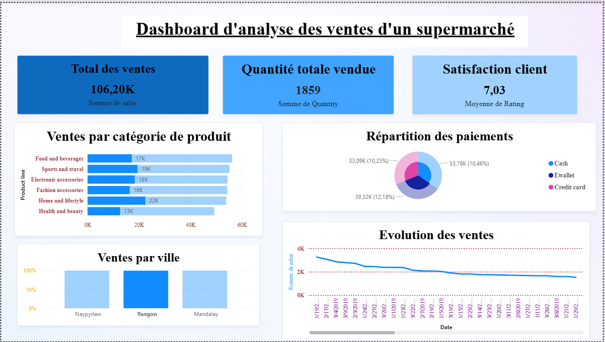
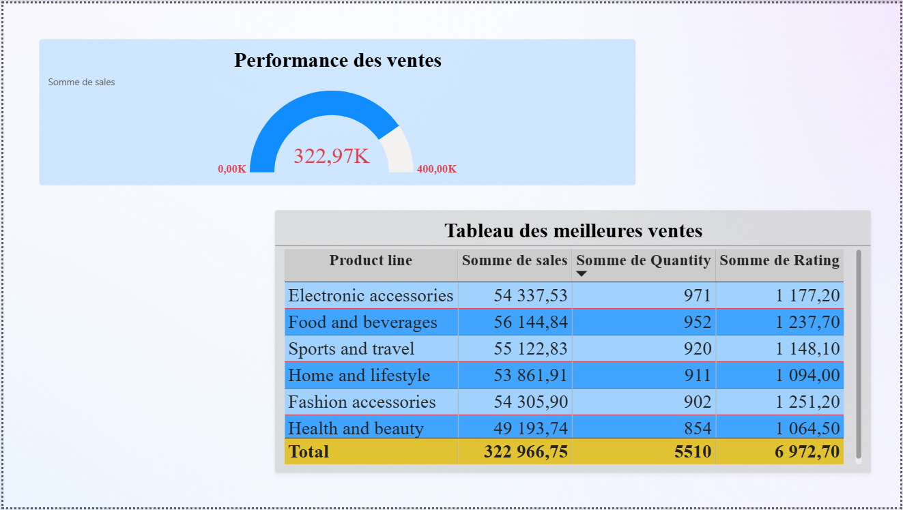

# Supermarket Sales Analysis

## Project Overview

This project analyzes supermarket sales data using **Python for data exploration** and **Power BI for interactive visualization**.  

The objective is to extract meaningful insights from transactional data and build a dashboard that helps understand sales performance, customer behavior, and product trends.

---

## Dataset

The dataset contains transactional sales information including:

- City of purchase
- Product category
- Quantity sold
- Total sales
- Payment method
- Customer rating
- Date and time of transaction

This data enables a comprehensive analysis of sales patterns and customer behavior.

---

## Tools & Technologies

The following tools were used in this project:

- Python
- Pandas
- Matplotlib
- Seaborn
- Jupyter Notebook
- Power BI

---

## Data Analysis

Exploratory Data Analysis (EDA) was performed using Python to understand the structure of the dataset and identify patterns in the data.

Key analyses include:

- Sales by product category
- Sales by city
- Payment method distribution
- Sales evolution over time
- Customer satisfaction analysis

---

## Key Insights

Some important insights obtained from the analysis:

- Certain product categories generate higher sales revenue.
- Sales are relatively balanced across the different cities.
- Customers use multiple payment methods including cash, credit cards, and e-wallets.
- Sales fluctuate over time depending on transaction activity.
- The average customer satisfaction rating is approximately **6.97 / 10**.

---

## Power BI Dashboard

An interactive **Power BI dashboard** was created to visualize key business metrics.

The dashboard includes:

- Total sales KPI
- Total quantity sold
- Customer satisfaction score
- Sales by city
- Sales by product category
- Payment method distribution
- Sales evolution over time
- Sales performance gauge

The dashboard allows users to explore the data interactively and gain insights into business performance.

---

## Project Structure

data-science-portfolio

├── supermarket-sales-analysis
│   ├── data
│   ├── notebook
│   ├── powerbi-dashboard
│   ├── images
│   └── README.md
		rapport_projet.pdf

---

## Business Value

This project demonstrates how data analysis and visualization can support business decision-making by identifying trends, customer preferences, and sales performance.

---

## Dashboard Preview

## Author

**Ange Désiré Boua**  
Master’s Student in Big Data & Artificial Intelligence  
Institut Universitaire d'Abidjan

Email: angedesireboua@gmail.com

[def]: images/dashboard_preview.png